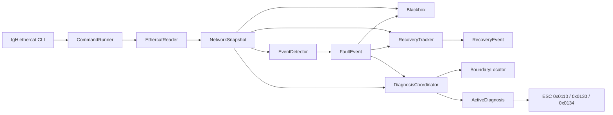

# IgH EtherCAT Diagnostics

[简体中文](README.zh-CN.md) | English

A lightweight, independent EtherCAT monitoring and fault-diagnosis tool for systems using the [IgH EtherCAT Master](https://etherlab.org/en/ethercat/).

Version: **v1.1.0**

## Overview

IgH EtherCAT Diagnostics continuously samples an IgH EtherCAT network, turns command output into structured C++ snapshots, detects topology and state changes, preserves evidence around a fault, actively reads key ESC registers at the suspected boundary, and reports when the network has recovered.

It runs beside an existing EtherCAT application. It does not control process data, force slave states, restart the master, or repair the network automatically.

## Why This Project

An EtherCAT application often tells you that communication failed, but not where the chain broke or what the last reachable slave reported. This project adds a small diagnostic observer that can answer:

- When did the link or topology change?
- Which slave positions disappeared?
- Where is the likely boundary between reachable and lost slaves?
- What did the boundary ESC report immediately after the fault?
- What network snapshots existed before and after the event?
- When did the complete network return, and how long was it unavailable?

## Features

- 1 Hz monitoring of Master 0 through `ethercat master` and `ethercat slaves`.
- Unified `NetworkSnapshot`, `MasterSnapshot`, and `SlaveSnapshot` models.
- Link, slave-count, lost-slave, and AL-state change events.
- Fault-boundary location from the last healthy and current topology.
- A rolling black box with up to 30 recent snapshots plus 10 post-trigger snapshots.
- JSONL fault files that are easy to process with Python, scripts, or later Web tooling.
- Burst reads of ESC registers `0x0110`, `0x0130`, and `0x0134`.
- Ten-second Cooldown to limit repeated active register reads.
- One-shot recovery events with fault duration and restored slave positions.
- Graceful shutdown on `SIGINT` and `SIGTERM`.
- Standalone `esc-diagnostic-probe` utility.
- 22 automated tests, including a guard that keeps assertions enabled in Release builds.

## Suitable Use Cases

- Commissioning and troubleshooting IgH-based EtherCAT systems.
- ARM64 edge computers and development boards such as RK3588.
- Linux controllers where a lightweight diagnostic side process is preferred over a database-backed platform.
- Capturing intermittent cable, connector, power, or downstream-slave failures.
- A reference implementation for learning modern C++ around a real industrial communication problem.

## Current Limitations

Version 1.1 intentionally stays small:

- Linux and the IgH `ethercat` command are required.
- Data collection still launches shell commands; direct ioctl access is future work.
- Master index is fixed to `0` in the monitor application.
- Sampling interval is fixed to 1 second.
- Active-diagnosis Cooldown is fixed to 10 seconds.
- Runtime files are written below `./logs`, relative to the process working directory.
- The black box saves the first triggered capture of each process run. Restart the program to arm a new capture.
- Recovery events are printed to the terminal; they are not appended to the saved fault JSONL in v1.1.
- No configuration-file parser, systemd service, automatic repair, root-cause engine, or Web UI is included.
- This is a diagnostic aid, not a safety function or safety-certified component.

## How It Works

Every second, the program reads master and slave status and creates a `NetworkSnapshot`. `EventDetector` compares consecutive snapshots. A lost-slave event starts one active diagnostic Burst: `BoundaryLocator` finds the last reachable slave and `ActiveDiagnosis` reads its ESC status registers. The black box keeps surrounding network history. `RecoveryTracker` keeps the pre-fault topology as its baseline and emits exactly one recovery event only after the link and complete topology return.

- **Burst** controls how much ESC data is read for one fault.
- **Cooldown** controls how often expensive active reads may run.
- **RecoveryTracker** decides when a fault episode is complete.

## Architecture



See [Architecture](docs/ARCHITECTURE.md) for module responsibilities, object relationships, state machines, error behavior, and extension points.

## Prerequisites

- Linux.
- A working IgH EtherCAT Master installation.
- The IgH `ethercat` CLI available through `PATH`.
- A C++17 compiler.
- CMake 3.18 or newer.
- Make or another CMake-supported build tool.

## Verified Reference Environment

v1.1.0 was built and tested with the following environment. This is a tested reference, not a platform restriction. Other Linux boards and architectures can be used when the prerequisites above are satisfied and the IgH CLI output is compatible.

| Component | Verified value |
| --- | --- |
| Board | Rockchip RK3588 TOYBRICK X10 Board |
| Operating system | Debian GNU/Linux 11 (bullseye) |
| Architecture | AArch64 (`aarch64`) |
| Kernel | Linux 5.10.161 |
| CPU | 8-core ARM Cortex-A55, Little Endian |
| IgH EtherCAT Master | 1.6.3 |
| EtherCAT CLI | `/usr/bin/ethercat` |
| EtherCAT kernel modules | `ec_master`, `ec_generic` |
| C++ compiler | GCC/G++ 10.2.1 |
| CMake | 3.18.4 |
| GNU Make | 4.3 |

Run the following commands to record and compare your environment before building:

```bash
cat /proc/device-tree/model; echo
cat /etc/os-release
uname -srmo
lscpu | grep -E 'Architecture|CPU\(s\)|Model name|Byte Order'
g++ --version | head -n 1
cmake --version | head -n 1
make --version | head -n 1
command -v ethercat
ethercat version
lsmod | grep -E '^(ec_master|ec_generic)'
ethercat master -m 0
ethercat slaves -m 0
```

The exact version strings may differ. However, `ethercat master -m 0` and `ethercat slaves -m 0` must work before running this project. If they fail, fix the IgH installation, driver modules, permissions, or master configuration first.

## Quick Start

Download or clone the repository, then enter its directory:

```bash
cd igh-ethercat-diagnostics
cmake -S . -B build -DCMAKE_BUILD_TYPE=Release
cmake --build build --parallel 4
cd build
ctest --output-on-failure
cd ..
sudo ./build/igh-ethercat-diagnostics
```

Press `Ctrl+C` to stop cleanly.

## Build and Test

Debug build:

```bash
cmake -S . -B build -DCMAKE_BUILD_TYPE=Debug
cmake --build build --parallel 4
```

Run all tests:

```bash
cd build
ctest --output-on-failure
cd ..
```

Entering the build directory keeps the test command compatible with CMake/CTest 3.18.

## Install

Install both executables into the default prefix, normally `/usr/local/bin`:

```bash
sudo cmake --install build
```

Installed commands:

```text
/usr/local/bin/igh-ethercat-diagnostics
/usr/local/bin/esc-diagnostic-probe
```

Use a different prefix when required:

```bash
cmake -S . -B build \
  -DCMAKE_BUILD_TYPE=Release \
  -DCMAKE_INSTALL_PREFIX=/opt/igh-ethercat-diagnostics
cmake --build build --parallel 4
sudo cmake --install build
```

This v1.1 package does not install or configure a systemd service.

## Run

Active ESC register reads commonly require elevated privileges. Start the monitor from a writable working directory:

```bash
mkdir -p "$HOME/igh-ethercat-diagnostics-runtime"
cd "$HOME/igh-ethercat-diagnostics-runtime"
sudo /usr/local/bin/igh-ethercat-diagnostics
```

Confirm that root can locate the IgH CLI if status reads fail:

```bash
sudo sh -c 'command -v ethercat && ethercat master -m 0'
```

Run the standalone register probe with a master index and slave position:

```bash
sudo /usr/local/bin/esc-diagnostic-probe 0 3
```

You can also run either executable directly from `build/` without installing it.

## Fault and Recovery Example

With four slaves online, disconnecting the cable after Slave 1 may produce events like:

```text
[EVENT] ... type=SLAVE_COUNT_CHANGED old=4 new=2 ...
[EVENT] ... type=SLAVE_LOST slave=2 ...
[EVENT] ... type=SLAVE_LOST slave=3 ...
[ACTIVE_DIAG] master=0 boundary=Slave1<->Slave2 status=success ...
```

After reconnecting the cable and restoring the full topology:

```text
[RECOVERY] ... description="EtherCAT network recovered" slaves=2->4 duration=3.200s recovered_positions=2,3
```

A partial return does not generate `[RECOVERY]`. Continued healthy samples do not duplicate it.

## Runtime Files

The application creates a `logs` directory below its current working directory:

```text
logs/
└── fault_<timestamp_ms>.jsonl
```

Each line is a JSON object describing a network snapshot or the trigger event. Because the recommended command runs as root, generated files may be owned by root.

## Troubleshooting

### `ethercat: not found`

Install the IgH command-line tool or add its directory to the service user's `PATH`. Check both the current user and root:

```bash
command -v ethercat
sudo sh -c 'command -v ethercat'
```

### Status works, but `reg_read` fails

Run the complete monitor with `sudo`. Starting only the probe with `sudo` does not grant privileges to an already-running unprivileged monitor.

### `No tests were found`

Run CTest from the generated build directory:

```bash
cd build
ctest --output-on-failure
```

### Wrong or empty slave count

Compare the raw IgH output:

```bash
ethercat master -m 0
ethercat slaves -m 0
```

The parser expects the normal English output format of the IgH CLI used by the tested release.

## Project Layout

```text
apps/       Executable entry points
include/    Public C++ headers grouped by responsibility
src/        Implementations for monitoring, detection, recording, ESC and diagnosis
tests/      Unit and integration-style executable tests
docs/       Detailed bilingual architecture documentation
```

## Roadmap

- V1.2: configuration and systemd deployment.
- V2.0: replace shell commands with direct ioctl access.
- V2.1: port CRC and Lost Link counters.
- V2.2: automatic root-cause analysis.
- V3.0: Web UI and external integrations.

## Contributing

Keep changes focused, compile with `-Wall -Wextra -Wpedantic`, and add tests for observable behavior. Run the complete CTest suite before opening a pull request.

## License

Copyright (c) 2026 Victor-Jiaxin Wang. Released under the [MIT License](LICENSE).
