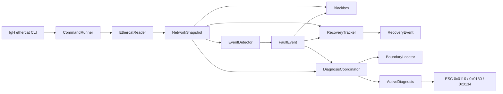

# IgH EtherCAT Diagnostics

简体中文 | [English](README.md)

一个面向 [IgH EtherCAT Master](https://etherlab.org/en/ethercat/) 系统的轻量级独立 EtherCAT 监控与故障诊断工具。

版本：**v1.1.0**

## 项目简介

IgH EtherCAT Diagnostics 持续采集 IgH EtherCAT 网络状态，将命令输出转换成结构化 C++ 快照，检测拓扑与状态变化，保存故障前后的现场信息，在疑似故障边界主动读取关键 ESC 寄存器，并在网络完整恢复时自动生成恢复事件。

它运行在现有 EtherCAT 应用旁边，不处理过程数据，不强制切换从站状态，不重启主站，也不会自动修复网络。

## 为什么需要这个项目

EtherCAT 应用通常能够报告通信失败，但不一定能说明链路在哪里断开，也无法保存故障发生瞬间最后一个可达从站的状态。本项目帮助回答：

- 链路或拓扑什么时候发生了变化？
- 哪些从站位置消失了？
- 可达从站与丢失从站之间的疑似边界在哪里？
- 故障发生后，边界位置的 ESC 报告了什么？
- 故障前后有哪些网络快照？
- 网络什么时候完整恢复，故障持续了多长时间？

## 已实现功能

- 通过 `ethercat master` 和 `ethercat slaves` 以 1 Hz 监控 Master 0。
- 统一的 `NetworkSnapshot`、`MasterSnapshot` 和 `SlaveSnapshot` 数据模型。
- Master Link、从站数量、从站丢失和 AL 状态变化事件。
- 根据故障前快照和当前拓扑定位故障边界。
- 保存最近最多30个快照以及触发后10个快照的内存黑匣子。
- 将故障现场保存为便于 Python、脚本和后续 Web 工具处理的 JSONL 文件。
- Burst 方式读取 ESC 寄存器 `0x0110`、`0x0130`、`0x0134`。
- 10秒 Cooldown，限制重复主动寄存器读取。
- 一次性 Recovery Event，记录故障持续时间及恢复的从站位置。
- 收到 `SIGINT`、`SIGTERM` 时安全退出。
- 独立的 `esc-diagnostic-probe` 寄存器诊断工具。
- 22项自动化测试，其中包含确保 Release 构建不会关闭测试断言的保护测试。

## 适用场景

- 调试和维护基于 IgH 的 EtherCAT 系统。
- RK3588 等 ARM64 边缘计算机和开发板。
- 希望使用轻量级独立诊断进程，而不想引入数据库平台的 Linux 控制器。
- 捕获偶发的网线、接插件、从站供电或下游从站故障。
- 结合真实工业通信问题学习现代 C++ 工程设计。

## 当前限制

V1.1 有意保持简单：

- 仅支持 Linux，并依赖 IgH 的 `ethercat` 命令。
- 当前仍通过 shell 命令采集数据，直接 ioctl 访问将在后续实现。
- 监控程序固定使用 Master 0。
- 采样周期固定为1秒。
- 主动诊断 Cooldown 固定为10秒。
- 运行文件写入进程工作目录下的 `./logs`。
- 每次进程运行只保存第一次触发的黑匣子；要重新布防，需要重启程序。
- V1.1 的 Recovery Event 输出到终端，尚未追加到故障 JSONL 文件。
- 尚未包含配置文件解析、systemd 服务、自动修复、根因分析和 Web UI。
- 本项目是诊断辅助工具，不属于安全功能，也未经过功能安全认证。

## 工作原理

程序每秒读取一次主站和从站状态并生成 `NetworkSnapshot`。`EventDetector` 比较连续快照。发现从站丢失时，只启动一轮主动诊断 Burst：`BoundaryLocator` 找出最后一个可达从站，`ActiveDiagnosis` 读取其 ESC 状态寄存器。黑匣子保存故障前后的网络历史。`RecoveryTracker` 将故障前拓扑作为恢复基线，只有 Link 和完整拓扑都恢复后才生成一次恢复事件。

- **Burst** 决定一次故障读取多少 ESC 数据。
- **Cooldown** 决定主动读取多久可以再次执行。
- **RecoveryTracker** 判断一次故障过程何时结束。

## 软件架构



模块职责、对象关系、状态机、错误处理和扩展点请阅读[架构说明](docs/ARCHITECTURE.zh-CN.md)。

## 前置条件

- Linux。
- 已正确安装并运行 IgH EtherCAT Master。
- IgH `ethercat` 命令可通过 `PATH` 找到。
- 支持 C++17 的编译器。
- CMake 3.18 或更高版本。
- Make 或其他 CMake 支持的构建工具。

## 已验证的参考环境

v1.1.0 已在下列环境完成编译和测试。这是一套可供复现和排查问题的参考环境，并非平台限制。只要满足上述前置条件，并且 IgH 命令输出格式兼容，也可以在其他 Linux 开发板和处理器架构上使用。

| 项目 | 实测值 |
| --- | --- |
| 开发板 | Rockchip RK3588 TOYBRICK X10 Board |
| 操作系统 | Debian GNU/Linux 11（bullseye） |
| 处理器架构 | AArch64（`aarch64`） |
| Linux 内核 | 5.10.161 |
| CPU | 8 核 ARM Cortex-A55，Little Endian |
| IgH EtherCAT Master | 1.6.3 |
| EtherCAT 命令 | `/usr/bin/ethercat` |
| EtherCAT 内核模块 | `ec_master`、`ec_generic` |
| C++ 编译器 | GCC/G++ 10.2.1 |
| CMake | 3.18.4 |
| GNU Make | 4.3 |

编译前可以运行以下命令，记录并对照自己的环境：

```bash
cat /proc/device-tree/model; echo
cat /etc/os-release
uname -srmo
lscpu | grep -E 'Architecture|CPU\(s\)|Model name|Byte Order'
g++ --version | head -n 1
cmake --version | head -n 1
make --version | head -n 1
command -v ethercat
ethercat version
lsmod | grep -E '^(ec_master|ec_generic)'
ethercat master -m 0
ethercat slaves -m 0
```

不同系统显示的具体版本可以不同，但运行本项目之前，`ethercat master -m 0` 和 `ethercat slaves -m 0` 必须能够正常工作。如果执行失败，请先检查 IgH 安装、驱动模块、命令权限和主站配置。

## 快速开始

下载或克隆仓库并进入项目目录：

```bash
cd igh-ethercat-diagnostics
cmake -S . -B build -DCMAKE_BUILD_TYPE=Release
cmake --build build --parallel 4
cd build
ctest --output-on-failure
cd ..
sudo ./build/igh-ethercat-diagnostics
```

按 `Ctrl+C` 可以安全停止程序。

## 编译和测试

Debug 编译：

```bash
cmake -S . -B build -DCMAKE_BUILD_TYPE=Debug
cmake --build build --parallel 4
```

执行全部测试：

```bash
cd build
ctest --output-on-failure
cd ..
```

进入 build 目录再运行 CTest，可以兼容 CMake/CTest 3.18。

## 安装

将两个可执行程序安装到默认路径，通常是 `/usr/local/bin`：

```bash
sudo cmake --install build
```

安装后的命令为：

```text
/usr/local/bin/igh-ethercat-diagnostics
/usr/local/bin/esc-diagnostic-probe
```

需要其他安装位置时：

```bash
cmake -S . -B build \
  -DCMAKE_BUILD_TYPE=Release \
  -DCMAKE_INSTALL_PREFIX=/opt/igh-ethercat-diagnostics
cmake --build build --parallel 4
sudo cmake --install build
```

V1.1 不安装或配置 systemd 服务。

## 运行

主动读取 ESC 寄存器通常需要管理员权限。请从一个可写的运行目录启动：

```bash
mkdir -p "$HOME/igh-ethercat-diagnostics-runtime"
cd "$HOME/igh-ethercat-diagnostics-runtime"
sudo /usr/local/bin/igh-ethercat-diagnostics
```

如果采集失败，请确认 root 用户也能找到 IgH 命令：

```bash
sudo sh -c 'command -v ethercat && ethercat master -m 0'
```

独立寄存器探针的参数依次是 Master Index 和 Slave Position：

```bash
sudo /usr/local/bin/esc-diagnostic-probe 0 3
```

也可以不安装，直接运行 `build/` 中的两个程序。

## 故障和恢复示例

4个从站在线时，拔掉 Slave 1 后面的网线可能产生：

```text
[EVENT] ... type=SLAVE_COUNT_CHANGED old=4 new=2 ...
[EVENT] ... type=SLAVE_LOST slave=2 ...
[EVENT] ... type=SLAVE_LOST slave=3 ...
[ACTIVE_DIAG] master=0 boundary=Slave1<->Slave2 status=success ...
```

重新连接网线并恢复完整拓扑后：

```text
[RECOVERY] ... description="EtherCAT network recovered" slaves=2->4 duration=3.200s recovered_positions=2,3
```

只有部分从站返回时不会生成 `[RECOVERY]`；网络持续正常也不会重复输出恢复事件。

## 运行文件

程序在当前工作目录下创建 `logs`：

```text
logs/
└── fault_<timestamp_ms>.jsonl
```

每一行都是一个 JSON 对象，记录网络快照或触发事件。由于推荐使用 root 运行，生成的文件可能归 root 所有。

## 常见问题

### `ethercat: not found`

请安装 IgH 命令行工具或将其目录加入运行用户的 `PATH`，并分别检查普通用户和 root：

```bash
command -v ethercat
sudo sh -c 'command -v ethercat'
```

### 状态采集正常，但 `reg_read` 失败

请使用 `sudo` 启动完整监控程序。只对探针使用 `sudo`，不会给已经以普通用户运行的监控程序增加权限。

### 显示 `No tests were found`

请在生成的 build 目录中运行 CTest：

```bash
cd build
ctest --output-on-failure
```

### 从站数量错误或为空

请比较 IgH 原始输出：

```bash
ethercat master -m 0
ethercat slaves -m 0
```

解析器面向本版本实机验证所使用的 IgH CLI 标准英文输出格式。

## 工程结构

```text
apps/       可执行程序入口
include/    按职责分类的公共 C++ 头文件
src/        监控、检测、记录、ESC 和诊断实现
tests/      单元测试及集成风格的可执行测试
docs/       双语架构说明
```

## 后续规划

- V1.2：配置文件和 systemd 部署。
- V2.0：使用 ioctl 代替 shell 命令。
- V2.1：端口 CRC 和 Lost Link 计数器。
- V2.2：自动根因分析。
- V3.0：Web UI 和外部系统集成。

## 参与贡献

请保持修改范围清晰，使用 `-Wall -Wextra -Wpedantic` 编译，并为可观察行为增加测试。提交 Pull Request 前请运行完整 CTest。

## 开源协议

Copyright (c) 2026 Victor-Jiaxin Wang。本项目使用 [MIT License](LICENSE)。
