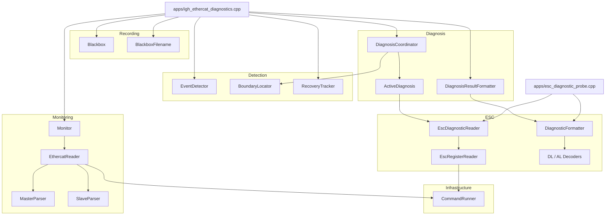
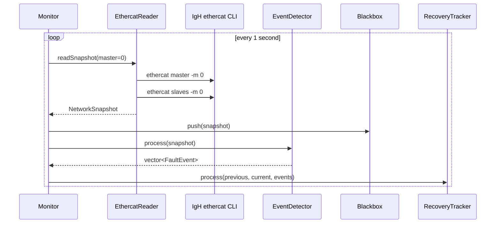
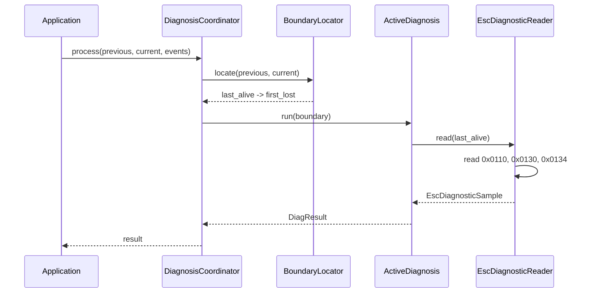
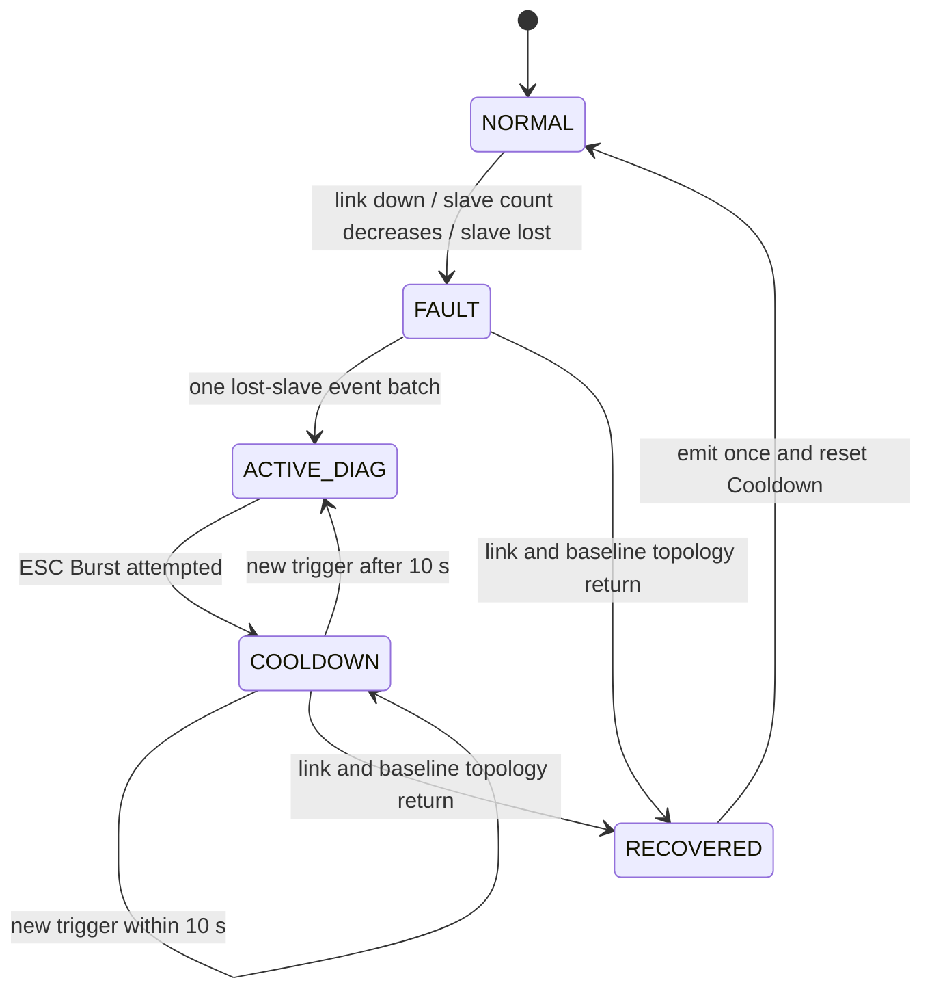

# Architecture

[简体中文](ARCHITECTURE.zh-CN.md) | English

This document describes the implemented architecture of IgH EtherCAT Diagnostics v1.1.0. It intentionally separates current behavior from roadmap ideas.

## Design Goals

- Observe an existing IgH EtherCAT network without owning process-data control.
- Turn command-line text into typed, testable C++ data.
- Detect transitions instead of printing the same condition every second.
- Preserve evidence before and after a failure.
- Limit active ESC reads to small Bursts with Cooldown.
- Correlate a fault with one complete-network recovery event.
- Keep hardware and shell access behind injectable boundaries for tests.

## Component Map



## Module Responsibilities

| Module | Responsibility | Important boundary |
|---|---|---|
| `common` | Snapshot, fault-event, and recovery-event data types | Contains data only; no hardware access |
| `infrastructure` | Runs a command and captures exit code/output | The only generic process boundary |
| `monitoring` | Parses IgH status and produces snapshots at a fixed interval | Does not decide whether a change is a fault |
| `detection` | Compares snapshots, locates lost topology boundaries, tracks recovery episodes | Does not read ESC registers |
| `recording` | Maintains the bounded history and writes JSONL fault captures | First capture per process in v1.1 |
| `esc` | Reads and decodes specific ESC registers | Knows register addresses and bit meanings |
| `diagnosis` | Decides when an active Burst runs and formats its result | Cooldown suppresses reads, not monitoring |
| `cli` | Validates numeric probe arguments | Prevents raw user text entering shell commands |
| `apps` | Composes the modules and owns process lifetime | Current V1.1 settings are fixed here |

## Core Data Model

`NetworkSnapshot` is the central hand-off object:

```text
NetworkSnapshot
├── MasterSnapshot
│   ├── timestamp_ms
│   ├── master_index
│   ├── phase / active / link_up
│   └── slave_count
└── vector<SlaveSnapshot>
    ├── position / alias / relative_position
    ├── AL state
    ├── online / has_error
    └── name
```

`FaultEvent` describes an observed transition. `RecoveryEvent` closes a tracked fault episode with start/end timestamps, duration, minimum observed slave count, recovered count, and positions that disappeared during the episode.

## Normal Sampling Sequence



`EventDetector` stores its own previous snapshot so unchanged samples produce no events. The application also keeps the previous snapshot because boundary location and recovery tracking require both sides of a transition.

## Fault and Active-Diagnosis Sequence

For a topology reduction, `EventDetector` can emit one `SLAVE_COUNT_CHANGED` plus one `SLAVE_LOST` event for every missing position. `DiagnosisCoordinator` treats the batch as one trigger, so multiple lost positions create one Burst.



If the boundary is invalid or there is no readable last-alive slave, the result is rejected without executing ESC reads. A rejected result does not start Cooldown.

## Burst, Cooldown, and Recovery



These are cooperating mechanisms, not one class-level state machine:

- `DiagnosisCoordinator` owns the last attempted-diagnosis timestamp.
- `RecoveryTracker` owns the active fault episode and expected pre-fault topology.
- `Blackbox` owns `RECORDING`, `POST_FAULT_RECORDING`, and `SAVING` states.
- The application connects a recovery result to `DiagnosisCoordinator::resetCooldown()`.

Cooldown never stops the 1 Hz monitor or recovery detection. A restored link alone is insufficient when expected slave positions are still missing. A recovery is emitted once all baseline positions and the link are back.

## Black-Box Recording

Before a trigger, `Blackbox` acts as a ring buffer capped at 30 snapshots. The first event changes it to post-fault recording. After 10 additional snapshots, it writes:

```text
./logs/fault_<trigger_timestamp_ms>.jsonl
```

Snapshot and trigger-event records are separate JSON objects, one per line. The current object remains in `SAVING`; the application attempts one file save per process run. Recovery is terminal output only in v1.1.

## Shell and Privilege Boundary

V1.1 calls:

```text
ethercat master -m <master>
ethercat slaves -m <master>
ethercat reg_read -m <master> -p <slave> ...
```

Monitor settings are compiled constants and probe arguments are parsed as integers before command construction. This limits command-injection exposure, but the shell process remains a dependency. Direct IgH ioctl access is the planned replacement.

`reg_read` commonly requires privileges even if status commands do not. Running the complete application with appropriate privileges is necessary for automatic active diagnosis.

## Failure Behavior

- A failed master/slave command rejects the candidate snapshot and logs a warning.
- Parser failure does not replace the last good snapshot.
- Invalid indices and malformed register output return explicit errors.
- Partial ESC samples preserve per-register errors for diagnosis output.
- Clock rollback clamps recovery duration to zero and does not create an effectively permanent Cooldown.
- Signal handlers only set a `sig_atomic_t` flag; normal cleanup happens in the monitor loop.

## Testability

External command execution is injected as a callable. Tests supply deterministic command results without needing an EtherCAT device. The suite covers parsers, monitoring cadence, events, boundary rules, recovery, black-box JSON escaping and files, register parsing, ESC bit decoders, active diagnosis, Cooldown, CLI validation, and header compatibility.

The real RK3588 test complements automation by checking the installed IgH CLI, permissions, live topology, physical cable loss, active register reads, and recovery.

## Extension Points

- **V1.2:** move fixed settings into a validated configuration object; add persistent logging and systemd packaging.
- **V2.0:** implement an ioctl-backed reader behind the existing reader boundary.
- **V2.1:** extend ESC samples and decoders with per-port CRC/Lost Link counters.
- **V2.2:** consume snapshots, events, boundaries, and ESC evidence in a root-cause analyzer.
- **V3.0:** publish status and event models through an API for a Web UI.

Keep the typed data and detection/diagnosis boundaries stable so these additions do not leak Linux or Web concerns into the core models.
