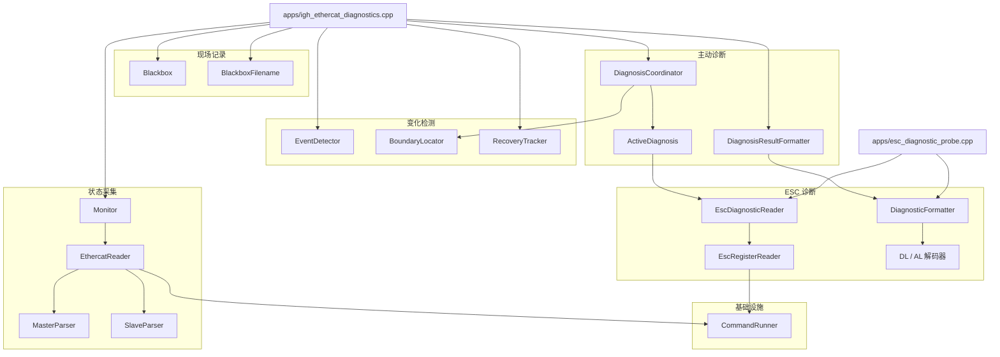
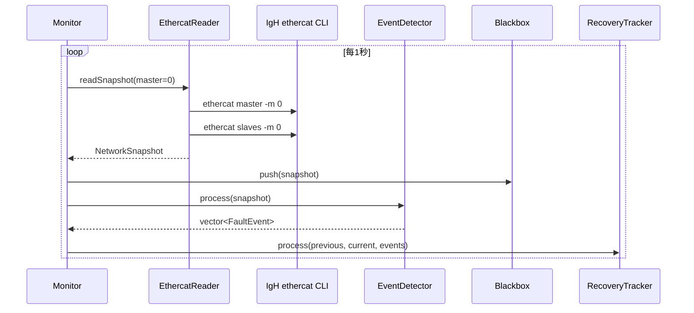
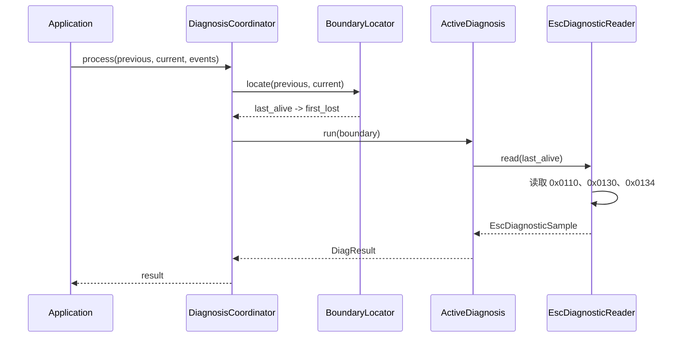
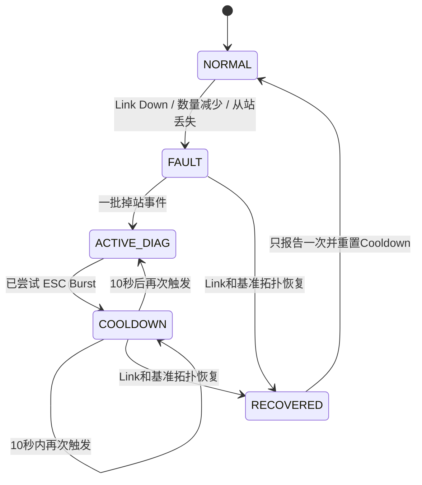

# 软件架构

简体中文 | [English](ARCHITECTURE.md)

本文说明 IgH EtherCAT Diagnostics v1.1.0 已经实现的软件架构，并明确区分当前功能和后续规划。

## 设计目标

- 在不接管过程数据控制的情况下观察现有 IgH EtherCAT 网络。
- 将命令行文本转换为具有明确类型、便于测试的 C++ 数据。
- 检测状态变化，而不是每秒重复报告同一个状态。
- 保存故障发生前后的现场证据。
- 通过小规模 Burst 和 Cooldown 限制主动 ESC 读取。
- 将一次故障和一次完整网络恢复关联起来。
- 将硬件和 shell 访问放在可注入边界之后，便于自动化测试。

## 组件关系



## 模块职责

| 模块 | 职责 | 重要边界 |
|---|---|---|
| `common` | 快照、故障事件、恢复事件的数据类型 | 只包含数据，不访问硬件 |
| `infrastructure` | 执行命令并获取退出码和输出 | 唯一的通用进程边界 |
| `monitoring` | 解析 IgH 状态，以固定周期生成快照 | 不判断一次变化是否属于故障 |
| `detection` | 比较快照、定位掉站边界、跟踪恢复过程 | 不读取 ESC 寄存器 |
| `recording` | 保存有界历史并生成 JSONL 故障文件 | V1.1 每次进程只保存第一次现场 |
| `esc` | 读取并解码指定 ESC 寄存器 | 知道寄存器地址和位含义 |
| `diagnosis` | 决定主动 Burst 的执行时机并格式化结果 | Cooldown 只限制读取，不限制监控 |
| `cli` | 校验探针的数字参数 | 防止原始用户文本进入 shell 命令 |
| `apps` | 组合所有模块并管理进程生命周期 | V1.1 固定参数位于这里 |

## 核心数据模型

`NetworkSnapshot` 是模块之间传递的核心对象：

```text
NetworkSnapshot
├── MasterSnapshot
│   ├── timestamp_ms
│   ├── master_index
│   ├── phase / active / link_up
│   └── slave_count
└── vector<SlaveSnapshot>
    ├── position / alias / relative_position
    ├── AL state
    ├── online / has_error
    └── name
```

`FaultEvent` 表示一次观测到的变化。`RecoveryEvent` 结束一次故障过程，保存故障开始和恢复时间、持续时间、最低从站数、恢复后的从站数，以及故障期间曾经消失的位置。

## 正常采集流程



`EventDetector` 在内部保存前一份快照，因此状态没有变化时不会生成重复事件。应用程序还保存一份前序快照，因为边界定位和恢复跟踪都需要变化前后的数据。

## 故障和主动诊断流程

拓扑缩小时，`EventDetector` 可以生成一条 `SLAVE_COUNT_CHANGED`，并为每个消失位置生成一条 `SLAVE_LOST`。`DiagnosisCoordinator` 将同一批事件作为一个触发条件，因此多个从站同时消失只执行一次 Burst。



如果边界无效，或者没有可读取的最后存活从站，诊断会返回拒绝结果，不执行 ESC 读取。被拒绝的结果不会启动 Cooldown。

## Burst、Cooldown 和 Recovery



这些机制相互协作，但不是由某一个类实现的单一状态机：

- `DiagnosisCoordinator` 保存上一次实际尝试诊断的时间。
- `RecoveryTracker` 保存当前故障过程和故障前的预期拓扑。
- `Blackbox` 保存 `RECORDING`、`POST_FAULT_RECORDING`、`SAVING` 状态。
- 应用程序在收到恢复结果时调用 `DiagnosisCoordinator::resetCooldown()`。

Cooldown 不会停止 1 Hz 监控，也不会停止恢复检测。如果预期从站仍然缺失，仅仅 Link Up 不能算完整恢复。Link 和故障前所有位置都回来后，程序才报告一次恢复。

## 黑匣子记录

触发前，`Blackbox` 是容量为30的环形缓冲区。第一次事件使它进入故障后记录状态；再采集10个快照后写入：

```text
./logs/fault_<trigger_timestamp_ms>.jsonl
```

快照和触发事件分别占用一行 JSON 对象。当前对象写完后保持在 `SAVING`，应用程序每次运行只尝试保存一个文件。V1.1 的恢复事件只输出到终端。

## Shell 和权限边界

V1.1 调用：

```text
ethercat master -m <master>
ethercat slaves -m <master>
ethercat reg_read -m <master> -p <slave> ...
```

监控参数是编译期固定值，探针参数在拼接命令前会解析为整数。这降低了命令注入风险，但 shell 进程仍是外部依赖，后续将以 IgH ioctl 访问替代。

即使状态命令可以由普通用户执行，`reg_read` 通常仍然需要更高权限。要让故障后的自动主动诊断工作，需要以合适权限运行完整程序。

## 失败处理

- Master 或 Slave 命令失败时，候选快照被拒绝并输出警告。
- 解析失败不会覆盖上一份有效快照。
- 非法索引和错误的寄存器输出会返回明确错误。
- ESC 只读取成功一部分时，结果中保留每个寄存器的错误。
- 系统时间回拨时，恢复持续时间归零，并避免 Cooldown 因无符号数下溢而永久生效。
- 信号处理函数只修改 `sig_atomic_t` 标志，正常清理由监控循环执行。

## 可测试性

外部命令执行通过可调用对象注入。自动化测试使用确定的命令结果，不需要连接 EtherCAT 设备。测试覆盖解析器、监控周期、事件、边界、恢复、黑匣子 JSON 转义和文件、寄存器解析、ESC 位解码、主动诊断、Cooldown、CLI 参数和头文件兼容性。

RK3588 实机测试作为自动化测试的补充，验证 IgH 命令、权限、真实拓扑、物理断线、主动寄存器读取和恢复过程。

## 扩展点

- **V1.2：** 将固定参数迁移到经过校验的配置对象，并增加持久日志和 systemd 部署。
- **V2.0：** 在现有 Reader 边界后增加 ioctl 实现。
- **V2.1：** 扩展 ESC 采样和解码器，增加每端口 CRC/Lost Link 计数器。
- **V2.2：** 使用快照、事件、边界和 ESC 证据实现根因分析器。
- **V3.0：** 通过 API 提供状态和事件模型，支持 Web UI。

应尽量保持类型化数据以及检测/诊断边界稳定，避免 Linux 或 Web 相关细节进入核心数据模型。
